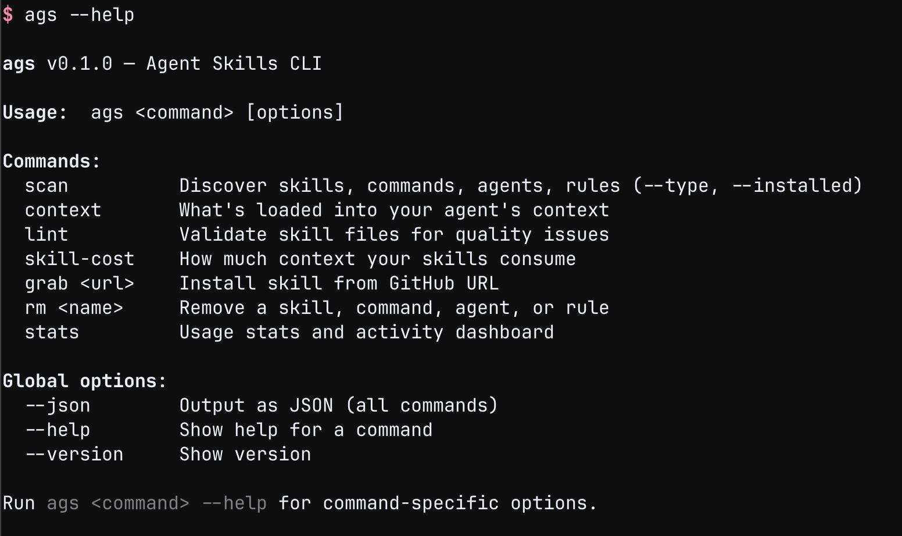
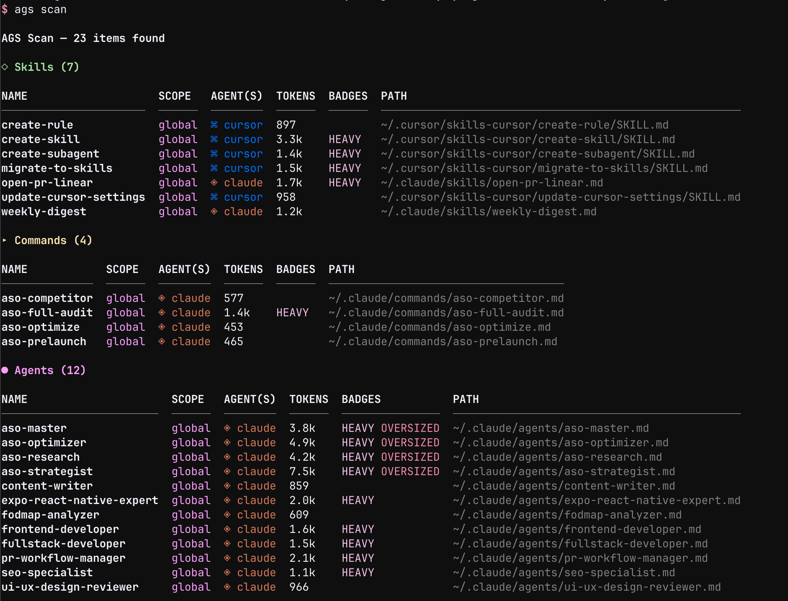
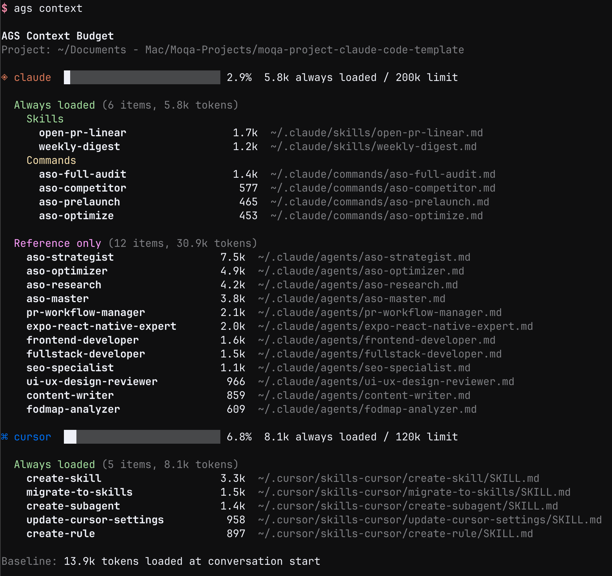
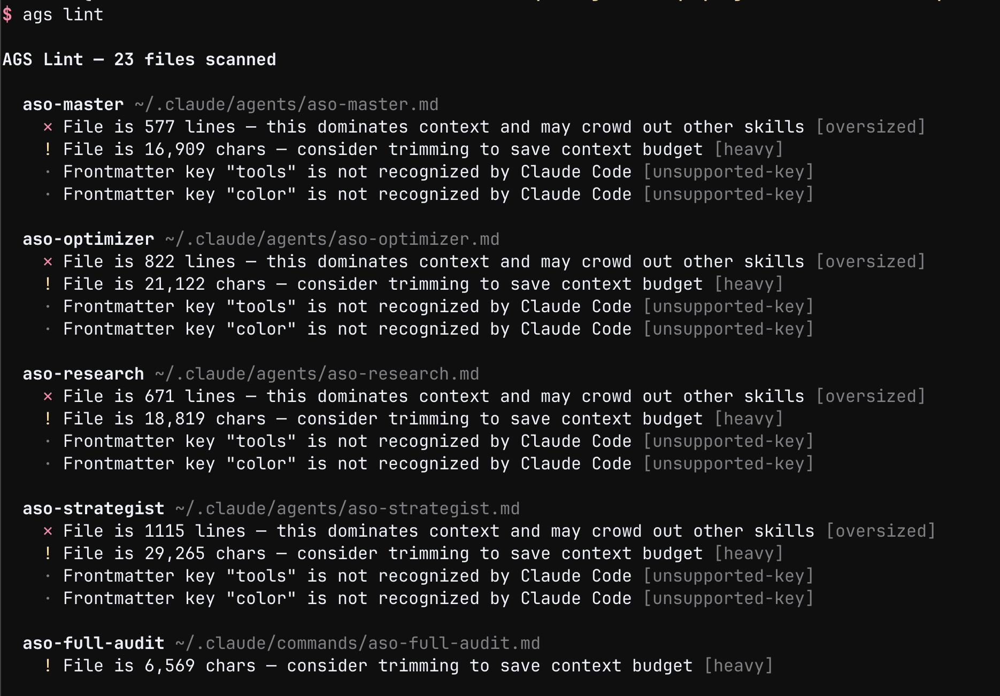
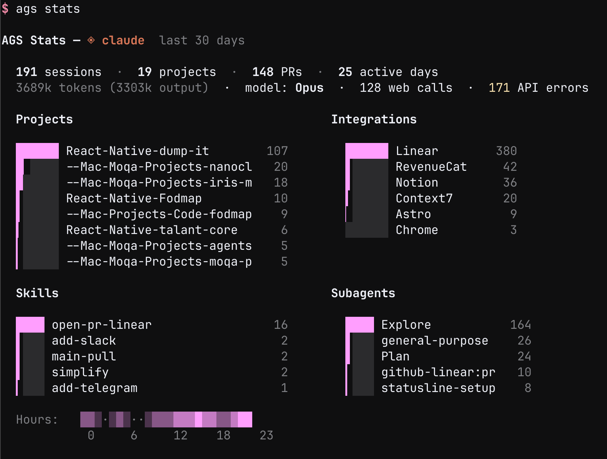

# ags - Agents CLI

[](https://github.com/moqa-studio/agents-cli/actions/workflows/ci.yml)
[](LICENSE)

One CLI to manage skills, commands, and rules across AI coding assistants.

Your skills are scattered across `~/.claude/skills/`, `.cursor/rules/`, `CLAUDE.md`, `.cursorrules` — different formats, different locations, no visibility into what's actually loaded. **ags** gives you a single command to scan, lint, measure, and manage all of it.

<p align="center">
  
</p>

## Install

Requires [Bun](https://bun.sh) v1.0+.

```bash
bun install -g @moqa/ags
```

Or from source:

```bash
git clone https://github.com/moqa-studio/agents-cli.git
cd agents-cli && bun install && bun link
```

### Shell completions

```bash
# Bash
echo 'source /path/to/agents-cli/completions/ags.bash' >> ~/.bashrc

# Zsh
cp completions/_ags /usr/local/share/zsh/site-functions/
```

## Supported agents

| Agent | Flag | Status | What ags manages |
|-------|------|--------|------------------|
| Claude Code | `--agent claude` | Full | Skills, commands, subagents, memory, MCP config |
| Cursor | `--agent cursor` | Core | Skills, rules (`.cursorrules`, `.mdc`) |
| Codex | `--agent codex` | Basic | Skills |

Every command accepts `--agent <name>` to filter. Without it, ags operates across all agents at once.

## Commands

### `ags scan`

Discover everything across all agents.

```
ags scan                            # all items
ags scan --agent claude             # Claude Code only
ags scan --type skill               # skills only
ags scan --scope local              # project-level only
ags scan --installed                # which agents are installed
```



### `ags context`

See what's loaded into your agent's context — config files, skills, commands, memory, MCP servers.

```
ags context                         # all agents
ags context --agent claude          # Claude Code only
```



### `ags lint`

Catch issues: missing frontmatter, short descriptions, oversized files, name conflicts, unsupported keys.

```
ags lint                            # everything
ags lint --agent cursor             # Cursor rules only
```



### `ags skill-cost`

Token budget — per-skill cost ranked by size, context usage bar per agent, suggestions to free tokens.

```
ags skill-cost                      # full report
ags skill-cost --scope local        # project skills only
```

### `ags grab <url>`

Install a skill from GitHub.

```
ags grab https://github.com/org/repo/blob/main/skills/foo/SKILL.md
ags grab <url> --to cursor          # install for Cursor
ags grab <url> --dry-run            # preview only
```

### `ags rm <name>`

Remove a skill, command, agent, or rule.

```
ags rm my-skill                     # all agents
ags rm my-skill --agent claude      # Claude Code only
```

### `ags stats`

Usage dashboard (Claude Code only).

```
ags stats                           # last 30 days
ags stats --period 7d               # last week
ags stats --period all-time         # everything
```



All commands support `--json` for structured output and `--help` for usage details.

## Contributing

```bash
bun test              # run tests
bun run typecheck     # type-check
```

### Adding support for a new agent

The entire multi-agent system is driven by a single registry in `src/core/agents.ts`. To add an agent:

1. Add an entry to `AGENTS` in `src/core/agents.ts` — paths, binary name, config files, frontmatter keys
2. Add the name to `AgentName` in `src/types.ts`
3. Add a context limit in `getContextLimit()` in `src/core/agents.ts`
4. Add styling in `AGENT_STYLE` in `src/utils/output.ts` — icon and brand color
5. Update completions in `completions/`

All commands (scan, lint, skill-cost, grab, rm, context) work automatically from the registry. Agent-specific features (memory, stats, MCP) are opt-in in the relevant command file.

## License

MIT
